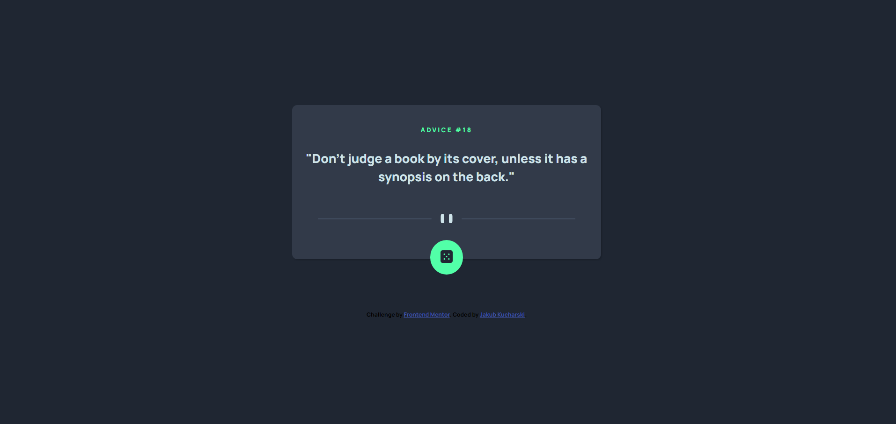

# Frontend Mentor - Advice generator app solution

This is a solution to the [Advice generator app challenge on Frontend Mentor](https://www.frontendmentor.io/challenges/advice-generator-app-QdUG-13db). Frontend Mentor challenges help you improve your coding skills by building realistic projects.

### The challenge

Users should be able to:

- View the optimal layout for the app depending on their device's screen size
- See hover states for all interactive elements on the page
- Generate a new piece of advice by clicking the dice icon

### Screenshot

### Links

- Solution URL: [Solution](https://www.frontendmentor.io/solutions/advice-generator-bem-sassscss-axios-flexbox-GlmlWLf-qe)
- Live Site URL: [Live](https://kucharzooo.github.io/advice-generator/)

## My process

### Built with

- Semantic HTML5 markup
- CSS custom properties
- Flexbox
- Mobile-first workflow
- Javascript
- BEM
- SASS/SCSS
- Axios

## Author

- Website - [Jakub Kucharski](https://github.com/Kucharzooo)
- Frontend Mentor - [@kucharzooo](https://www.frontendmentor.io/profile/Kucharzooo)
